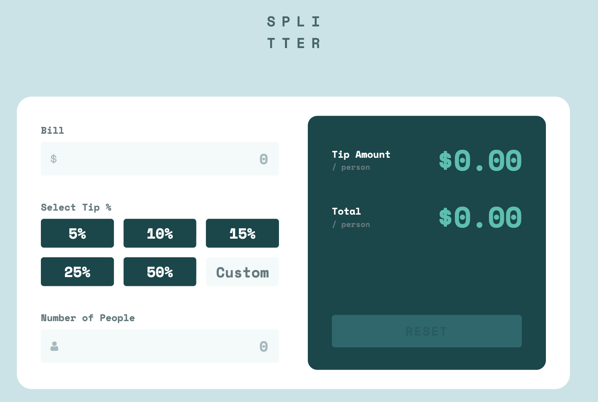

# Tip Calculator App

## Table of contents

- [Overview](#overview)
  - [Screenshot](#screenshot)
  - [Links](#links)
- [My process](#my-process)
  - [Built with](#built-with)
- [Author](#author)

## Overview

### Screenshot

### Links

- Solution URL: [Solution URL](https://github.com/kisu-seo/tip_calculator_app)
- Live Site URL: [Live URL](https://kisu-seo.github.io/tip_calculator_app/)

## My process

### Built with

- **React 18** — Component-based architecture. Leverages a Custom Hook (`useTipCalculator`) to isolate business logic, and reusable UI components (`InputField`, `TipSelector`, `ResultRow`) for high maintainability.
- **Vite 6** — Utilized as the fast frontend build tool and development server for near-instant HMR (Hot Module Replacement).
- **Tailwind CSS v3** — Mobile-first approach implemented entirely through utility classes. Design system tokens (custom colors, Space Mono font) are centrally managed in `tailwind.config.js`.
- **Semantic HTML5 markup** — Built with accessibility (A11y) in mind, utilizing proper semantic tags (`<fieldset>`, `<legend>`) and ARIA attributes (`aria-live`, `aria-hidden`).
- **Responsive Layout** — Fluidly transitions from a vertical stack on mobile devices to a structured 2-column grid (`lg:grid-cols-2`) on desktop viewports.

## Author

- Website - [Kisu Seo](https://github.com/kisu-seo)
- Frontend Mentor - [@kisu-seo](https://www.frontendmentor.io/profile/kisu-seo)
